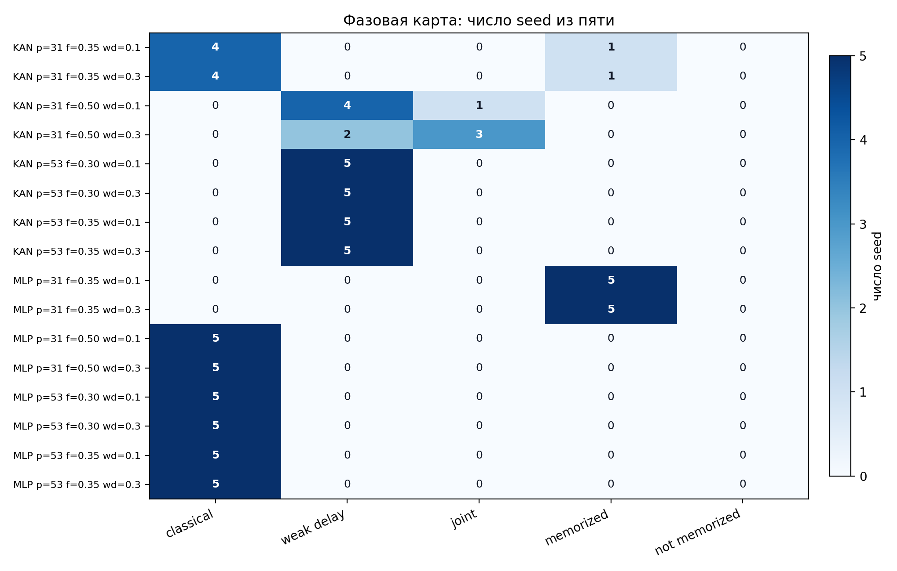

# Grokking in modular arithmetic: quadratic MLP vs spline KAN

A reproducible study of **when** small neural networks memorize and generalize modular addition. I compared a quadratic MLP with a similarly sized spline KAN under the same data, loss and full-batch AdamW training. The main result is a change in the *phase map*, not a universal win for either architecture.



## Results at a glance

The confirmatory matrix contains **80 runs**: 4 data conditions × 2 architectures × 2 weight decays × 5 fixed seeds. A run counts as classical grokking only after sustained training memorization, poor test accuracy at that point, a plateau of at least 1,000 steps, and sustained 99% test accuracy. All other dynamics remain separate categories.

| Condition | Quadratic MLP | Spline KAN |
| --- | ---: | ---: |
| `p=31`, 35% training pairs | 0/10 classical | 8/10 classical |
| `p=31`, 50% training pairs | 10/10 classical | 0/10 classical |
| `p=53`, 30% or 35% training pairs | 20/20 classical | 0/20 classical |
| **All 80 runs** | **30/40 classical** | **8/40 classical** |

At `p=53`, all 20 KAN runs reached the separately defined *weak delayed generalization* category. A symmetry-safe split removed the KAN result at `p=31`, 35% (0/5 classical). The available MLP symmetry-safe control used **50%** training pairs, so those two controls are not a matched architectural comparison. See the [full phase table](results/tables/paired_summary.csv), [individual runs](results/tables/paired_runs.csv), and [protocol](docs/research_protocol.md).

## What is in this repository

- `src/`: data splits, models, training, phase classification, Fourier and PCA analysis.
- `configs/final_study.yaml`: the fixed 80-run matrix.
- `scripts/`: run, aggregate, analyze, plot and audit the study.
- `tests/`: unit and integration checks.
- `results/`: per-run histories, summaries, selected checkpoints, aggregate tables and figures.
- `docs/report.pdf`: full research report; `docs/grokking_kan_study.pdf`: shorter study presentation.
- [Code map](docs/code_map.md) and [Russian overview](docs/README.ru.md).

The release includes all 80 run summaries and histories. Model weights and phase snapshots are included for the ten prespecified mechanistic runs. `RESULTS_MANIFEST.csv` and `SHA256SUMS.txt` inventory the released artifacts.

## Quick start

Use Python 3.11 or 3.12. These commands are for PowerShell; on macOS/Linux, activate `.venv/bin/activate` and use `\` for line continuation.

```powershell
py -3.12 -m venv .venv
.\.venv\Scripts\Activate.ps1
python -m pip install -r requirements.txt
python -m pytest -q
python scripts/run_experiment.py `
  --config configs/gromov_quadratic_adamw.yaml `
  --output-dir results/core_runs/smoke `
  --set training.max_steps=200 `
  --set training.eval_every=20
python scripts/make_figures.py --run-dir results/core_runs/smoke
```

The 200-step smoke run tests the pipeline; it is too short to demonstrate grokking. Each override needs its own `--set`.

## Reproduce and inspect

```powershell
python scripts/run_study.py --manifest configs/final_study.yaml --output-dir results/core_runs --workers 4
python scripts/aggregate_study.py --input-dir results/core_runs
python scripts/analyze_mechanism_matrix.py --study-dir results/core_runs
python scripts/audit_study.py
```

Full reproduction requires substantially more compute than the smoke run. `run_study.py` resumes completed runs rather than overwriting them. The main matrix trains for 15,000 steps at `p=31` and 20,000 at `p=53`, with no early stopping. The audit checks the released data and derived artifacts without retraining.

## Interpretation and limits

This is an adapted comparison based on Gromov's quadratic MLP architecture, **not** an exact reproduction of that paper's optimization protocol. The initial `p=97` exploration was excluded from the fixed matrix. Five seeds per cell leave wide uncertainty intervals. The random split can put `(a,b)` in training and `(b,a)` in testing; the symmetry-safe control shows this choice matters. Fourier concentration, hidden-state PCA and KAN edge ablation are evidence about representations, not proof that a network discovered a unique arithmetic algorithm. The [report](docs/report.pdf) covers methods, negative results and limitations.

## License

Code and documentation are released under the [MIT License](LICENSE).
